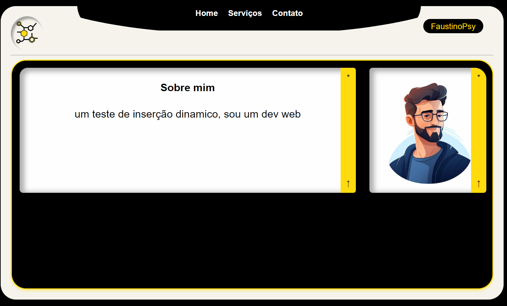
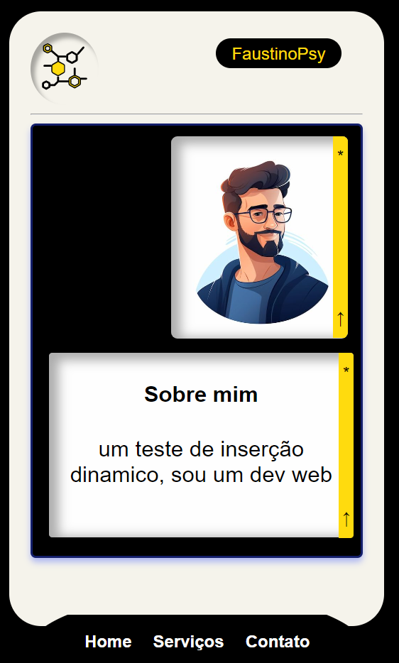

# Site Modelo de Portfólio

Bem-vindo ao Site Modelo de Portfólio! Este projeto é um template para criar um site de portfólio pessoal. Ele inclui seções para exibir seu trabalho, habilidades, experiência e informações de contato.

## Índice

- [Recursos](#recursos)
- [Instalação](#instalação)
- [Tecnologias Utilizadas](#tecnologias-utilizadas)
- [Estrutura de Arquivos](#estrutura-de-arquivos)
- [Imagens](#Imagens)

## Recursos

- **Design Responsivo**: Funciona em todos os dispositivos, de mobile a desktop.
- **Mostrar Projetos**: Exiba seu melhor trabalho com imagens e descrições.
- **Seção de Habilidades**: Destaque suas principais habilidades e competências.
- **Linha do Tempo de Experiência**: Compartilhe sua trajetória profissional com uma linha do tempo.
- **Formulário de Contato**: Permita que os visitantes entrem em contato com você facilmente.
- **Rolagem Suave**: Melhore a experiência do usuário com transições suaves entre seções.


## Instalação

Para começar com este projeto, siga estas etapas:

1. **Clone o repositório:**
   ```sh
   git clone https://github.com/faustinopsy/politicos.git
    ```
## Tecnologias Utilizadas
HTML5
CSS3
JavaScript

## Estrutura de Arquivos
Aqui está uma visão geral da estrutura de arquivos do projeto:
```
.
├── index.html
├── css
│   └── styles.css
├── js
│   ├── app.js
│   ├── blocoText.js
│   ├── cards.js
│   ├── contato.js
│   ├── home.js
│   ├── navbar.js
│   └── servicos.js
└── assets
    └── img
        └── avatar.jpg
    
```
## Imagens

